# English-Dictionary-CGI
CGI Program with Enhanced Features: Word Search, Learning Functionality, and Customization Options

# Example
## 1. Look up word 単語を検索する
Search 検索画面
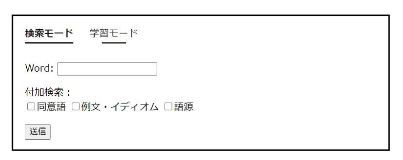
In case of additional search 追加検索の場
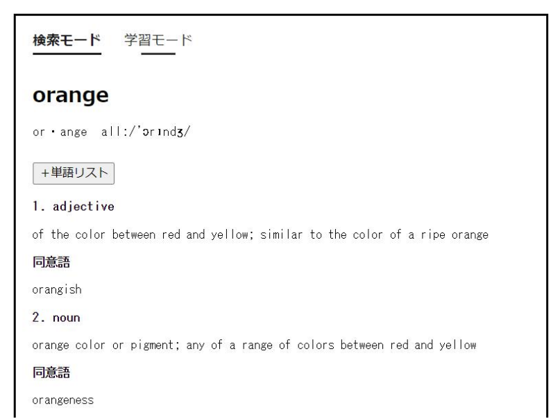
When the input is empty 空欄の場合
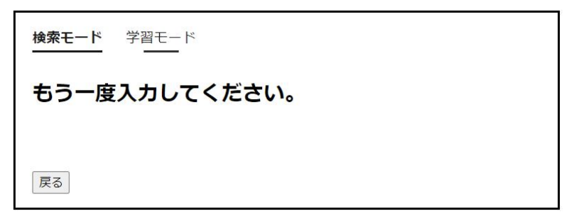
When the word cannot be found 単語が検索できない場合
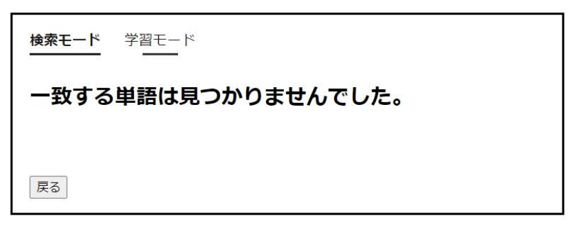

## 2. Add to the word list 単語リストに追加する

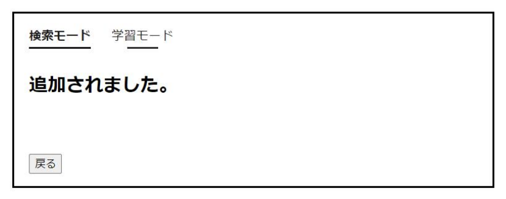
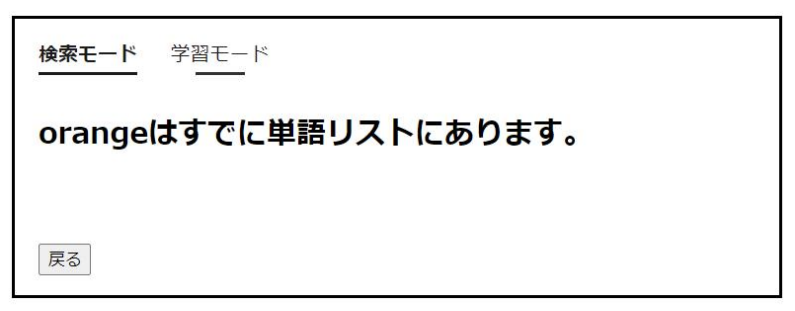

## 3. Study Mode Customize 学習カスタマイズ
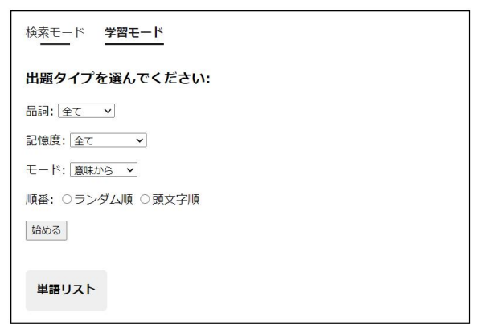
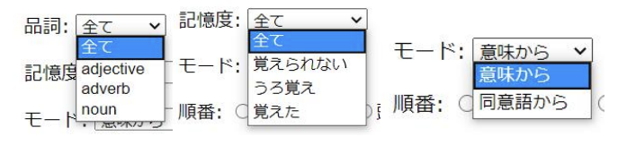
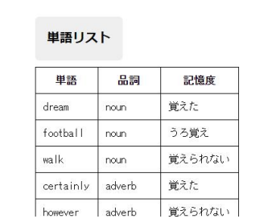
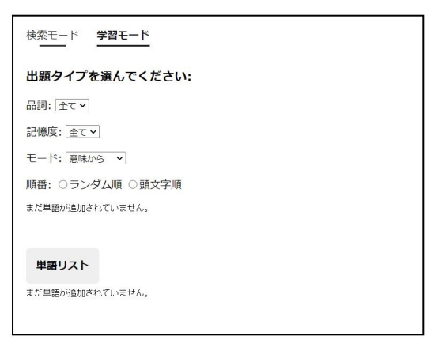

## 4. Begin and End学習開始・終了
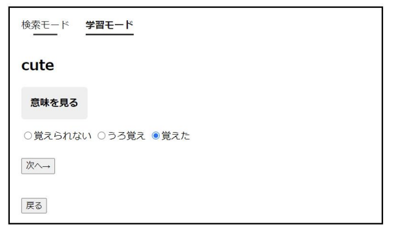
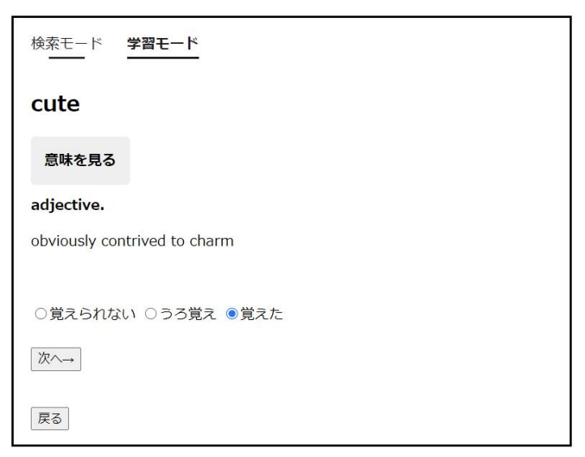
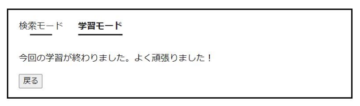
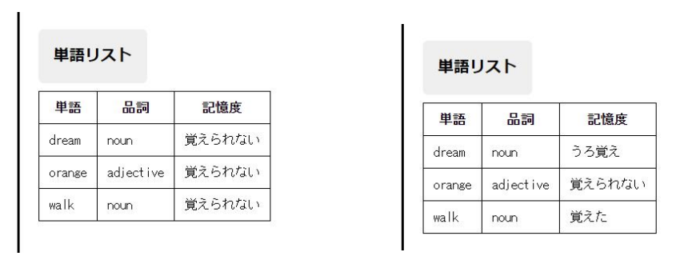